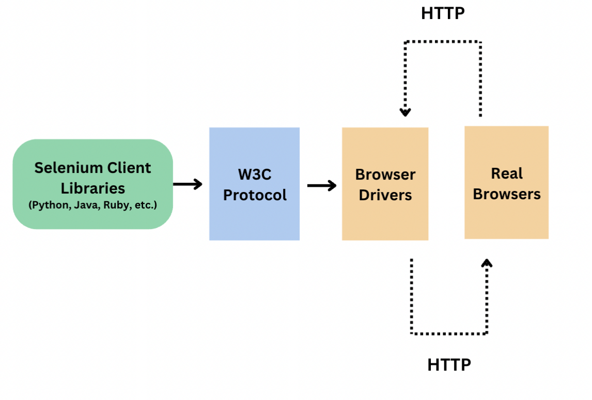
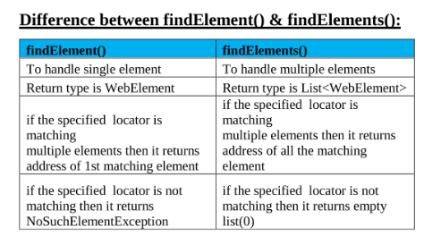
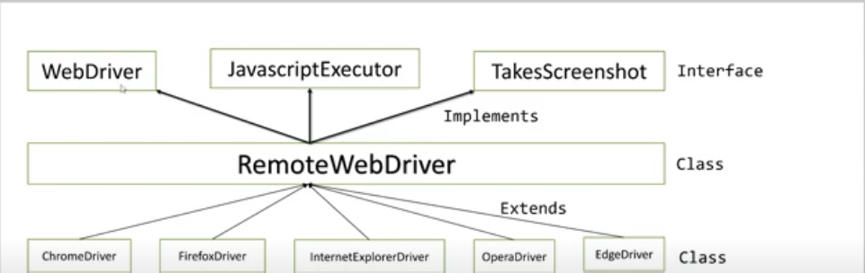
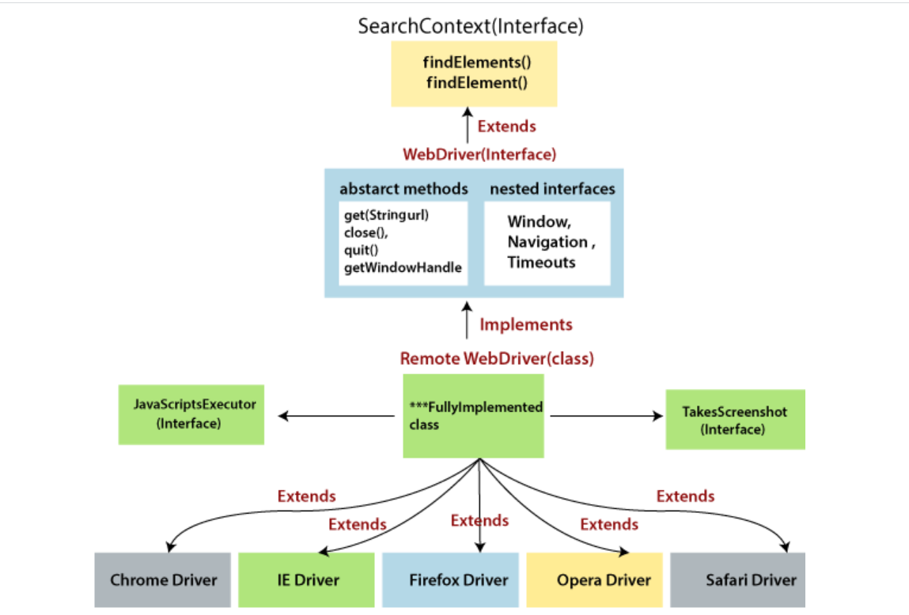
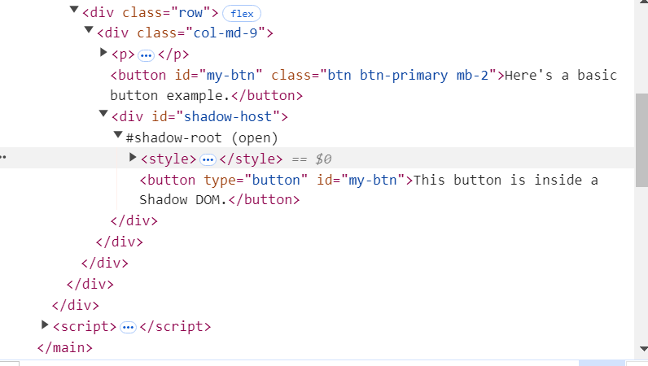
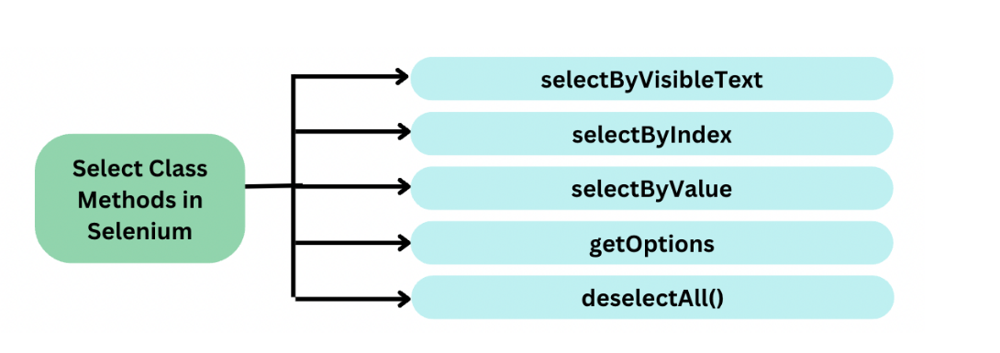
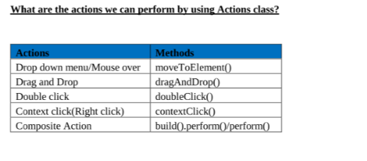

# selenium-interview-questions

## 1. What is Selenium WebDriver?
Selenium WebDriver is a component of Selenium that helps in automating web browsers.

### 2. Architecture of Selenium?


## 3. What are the various WebDriver methods in selenium?
```java
1. driver.get(url)
2. driver.switchTo()
3. driver.getTitle()
4. driver.getWindowHandles()
5. driver.getWindowHandle()
5. driver.getWindowHandle()
6. driver.close()
7. driver.quit()
8. driver.findElement()
9. driver.findElement(By.xpath("//input[@name='uid']"))
```

## 4. What are WebElement methods?
Anything present on the webpage is called as webelement.Like checkbox, textbox, buttons etc

Before performing any action on the elements.We have to perform the following steps
1. Inspect the element.
2. Locate the element.
3. Find the element.
4. perform action on the element.

### Methods of WebElement interface-
1. element.sendKeys("abc")
2. element.isDisplayed()
3. element.isSelected()
4. element.submit()
5. element.isEnabled()
6. element.clear()
7. element.getText()
8. element.getAttribute("id")
9. element.click()
10. element.getTagName()


## 5. Difference between close() and quit() method ?
1. close is used to close current browser window
2. quit is used to close all opened browser windows.

## 6. How to initialize driver to run on different browsers ?
Here we are creating an object of child class and assigning to parent reference variable. This is upcasting. We do this so we can run test on multiple browsers.
```java
1. WebDriver driver = new ChromeDriver();
2. WebDriver driver = new FirefoxDriver();
```

## 7. What is a Xpath?
Xpath is an expression or syntax to locate an element on the webpage.

Xpath=//tagname[@attribute='value']

Different ways to find elements on the web page. There are 8 types of locators and all the locators take string as an argument.
```java
1. id(String)
2. name(String)
3. className(String)
4. tagName(String)
5. linkText(String)
6. partialLinkTest(String)
7. xpath(String)
```
There are two types of XPath:

1) Absolute XPath - Starts from parent node of DOM, all the way to destination. The key characteristic of XPath is that it begins with the single forward slash(/) ,which means you can select the element from the root node.
2) Relative XPath - can start from anywhere in the DOM. It starts with double forward slash (//). It can search elements anywhere on the webpage.

## 8. How to search dynamic elements on the webpage?
We can use contains or stars-with method to find dynamic elements.

### 1. contains() is a method used in XPath expression.
```java
//tagname[contains(@attribute,'value')]
//input[contains(@name,'uid')]
<div class="new-training">Selenium Online Trainings</div>
//div[contains(text(),'Selenium Online Trainings')]
```

### 2. starts-with is a function used for finding the web element whose attribute value gets changed on refresh or by other dynamic operations on the webpage.

For example -: Suppose the ID of particular element changes dynamically like:
```java
Id=” message12″
Id=” message345″

<input id="message123">user id must not be blank</label>
Xpath=//input[starts-with(@id,'message')]
```
## 9. Difference between findElement and findElements in Selenium?


## 10. How to find count of links on the webpage?
```java
driver.get("https://www.google.com")
List<WebElement> ls = driver.findElements(By.tagName("a"));
System.out.println(ls.size());
    for(WebElement element : ls){
    System.out.println(element.getAttribute("href"));
   }
```

## 11. How to check logo available or not ?
```java
driver.get("https://www.google.com");
WebElement element = driver.findElement(By.xpath("//*[@name='logo']"));
boolean logoPresent = element.isDisplayed();
assert.assertTrue(logoPresent);
```
1. assertTrue(boolean condition): This Assertion verifies the Boolean value returned by the condition. If the Boolean value is true, then the assertion passes the test case.
2. assertEquals(String ExpectedTitle, String ActualTitle);
3. assertNotNull(String titleValue);

## 12. How to get element attribute value in selenium ?
```java
driver.get("https://www.google.com");
WebElement element = driver.findElement(By.id("uid"));
String str = element.getAttribute("value");
System.out.println(str);
```

## 13. How to check page title in selenium ?
```java
driver.get("https://www.google.com");
String str = driver.getTitle();
assertEquals(str,"Facebook");
```

In our automation framework we have a method getPageTitle() in BasePage abstract class which is common for all the page classes. This promotes reusability.
```java
public String getPageTitle(){
System.out.println("Returning Title");
return driver.getTitle();
}
```
## 14. How to handle alerts in selenium?
There are 3 types of javascript popup
1. Alert - contains only ok button
2. Confirmation - contains ok and cancel button
3. Prompt - also contains text
We cannot move the popup.We cannot inspect the popup.

```java
driver.get("https://www.google.com");
Alert alert = driver.switchTo.alert();
alert.accept();
driver.switchTo.defaultContent();
```
Prompt alert
```java
driver.get("https://www.google.com");
Alert alert = driver.switchTo.alert();
alert.sendKeys("Yes");
alert.accept();
driver.switchTo.defaultContent();
```

## 15. What are xpath axis?
Xpath axis are used to find complex elements.

Check url for xpath axis - https://github.com/aditya2001/advanced-xpath-locators/blob/master/README.md

## 16. Difference between get and navigate method in WebDriver?

1. driver.navigate.to("https://www.google.com");
2. driver.navigate().refresh();
3. driver.navigate().back();
4. driver.navigate().forward();

`get method` -> a) The get() method takes a string URL as a parameter and returns nothing.
This method opens the specified URL in the current browser window. URL must be in the form of https://www.google.com. If the HTTPS is not included then it will throw a message “Cannot navigate to invalid URL”.

The `getTitle()` method takes nothing as a parameter and returns the page title of the currently loaded web page. If the web page has no title, it will return a null String.

The `getText()` method accepts nothing as a parameter and returns a string value.
This method is used to retrieve the inner text of the specified element.

`getCssValue() : String`
The `getCssValue()` method accepts nothing as a parameter and returns a String value.
This method is used to fetch the value of the CSS property of the given web element when it is invoked.

`getAttribute(String Name) : String`
a) The getAttribute() method takes the String as a parameter and returns a String value.
b) It is used to fetch or get the value of the attribute of the WebElement.

`close() : void`
a) The close method takes nothing as a parameter and returns nothing.
b) This method is used to close only the browser window that web driver is currently controlling.

`quit() : void`
a) The quit() method accepts nothing as a parameter and returns nothing.
b) This method is used to close all windows opened by WebDriver.

### difference between get and navigate method of selenium WebDriver?
driver.get() used to launch a particular website url, whereas driver.navigate().to() is also used to launch the particular website by passing the URL but we can use forward and backward button to navigate between the pages during test case writing.

Both are exactly same, both are synonyms of each other. In fact navigate.to() method is calling get() method internally.

Get Method takes only string as parameter, whereas navigate can take string as well URL instance as parameters.

## 17. Why do we need to typecast driver object?

```java
WebDriver driver = new ChromeDriver();
JavascriptExecutor jsExecutor = (JavascriptExecutor) driver;
TakesScreenshot ts = (TakesScreenshot) driver;
```

Why are we doing typecasting WebDriver instance to JavascriptExecutor or TakesScreenshot.



##### driver pointing to ChromeDriver class object does not has methods from JavascriptExecutor or TakesScreenshot, because  we are instantiating class using WebDriver interface.




## 18. How to get size of browser window in selenium?
Selenium provides a class named Dimension which can be used to get the current size of the browser window and set the new size of the browser window. Size means the height and width of the browser.

```java
Dimension currentDimension = driver.manage().window().getSize();
int height = currentDimension.getHeight();
int width = currentDimension.getWidth();
System.out.println("Current height: "+ height);
System.out.println("Current width: "+width);
```

## 19. How to unselect a checkbox?
```java
<input type="checkbox" id="vehicle1" name="vehicle1" value="Bike">
```
WebElement element=driver.findElement(By.id("#vehicle1"))

element.click();

## 20. How to handle no element found exception without using try catch or throws?
Ans - Use explicit wait time.

Here are different ways to handle NoSuchElementException in Selenium:
NoSuchElementException is thrown by the findElement() method in Selenium WebDriver when the desired web element cannot be located using the specified locator, such as ID, name, CSS Selector, or XPath.

1. `Dynamic values` -> Some web elements are very dynamic in nature. In such cases the specified locator cannot be accessed by Selenium WebDriver as its properties keep on changing causing NoSuchElementException.
    For example, while automating, the locator value was “//a[@class=’abc_123’]”, however while executing the test the class value got changed to “abc_456”.
    We can handle this using `contains` or `starts-with` method.

2. `element not yet loaded` -> Some elements take time to load as there can be synchronization issues between app and selenium script and therefore we may get no such element exception.

    We can handle this using dynamic wait time like `explicit wait time`.
```java
WebDriverWait wait =new WebDriverWait(driver, Duration.ofSeconds(10)
WebElement login=wait.until(ExpectedConditions.elementToBeClickable(By.xpath("//button[text()='login']")));
login.click();
```

3. `Incorrect locators`- fix the locator.

4. `element inside a frame` -> Some web elements are inside frame/ iframe and it is only discovered when you encounter an exception. Always check if the element is inside any frame and in such case switch to the frame/ iframe and then perform the action on the desired web element.

## 21. Different exceptions in selenium?
1. `No Such Element Exception` -> Raised for incorrect locator or when element is not yet loaded.
2. `NoAlertPresentException Exception` -> Raised when an expected alert is not present. Happens when trying to interact with an alert that doesn’t exist..
    Handle alerts inside a try catch block.

 ```java
  try {
  Alert alert = driver.switchToAlert();
  }
  catch(){
  System.out.print("No alert present")
  }
 ```
   A good way to resolve this is to:
   Always check for and handle alerts before proceeding with any other interactions.
   Handle Alerts `Use Try-Catch`: Encapsulate actions in a try-catch block and handle alerts if they appear.

3. `ElementNotInteractableException` ->
   Element Not Interactable Exception is raised when an element is found but is not interactable (e.g., it’s hidden or disabled).
   
   Resolution ->
   The primary resolution method for an ElementNotInteractableException is to ensure that the element is both visible and enabled before interacting with it. Use explicit wait with expected conditions.

4. `No Such window Exception` -> When target window is not present.

## 22. If both implicit and explicit wait is defined, which one will execute first?
If you have both waits applied then both waits will be applicable in common scenarios.

1. `Implicit wait` -> driver.manage().timeouts().implicitlyWait(30, TimeUnit.SECONDS);
   It should throw NoSuchElementException after 30 seconds i.e. implicit wait timeout.

2. `Explicit Wait` -> WebDriverWait wait = new WebDriverWait(driver, Duration.ofSeconds(10));
   You will see WebDriver will poll at an interval of 500 MS for 10 seconds and will throw timeout exceptions as there is no such element.
  ```java
  custom polling interval ->
  wait.pollingEvery(Duration.ofSeconds(2));
```
Now WebDriver will poll to check condition on an interval of 2 seconds and terminate after 10 seconds.

#### Let’s mix implicit and explicit wait and observe the behavior.
First driver will wait for implicit wait, if not found, it will apply explicit wait and keep polling for default interval.


## 23. Difference between Selenium 3 and Selenium 4?
 
#### Architecture
Selenium 4 uses the `W3C protocol` to standardize communication with browsers, while Selenium 3 uses the JSON wire protocol over HTTP

#### WebDriver Manager
`WebDriverManager` in Selenium 4 automatically downloads the appropriate driver binaries based on the specified browsers, handles the configuration, and ensures compatibility.

#### Options class 
In Selenium 4, the DesiredCapabilities class has been deprecated, and the Options class has been introduced as a replacement for configuring and customizing the desired capabilities of browsers or browser drivers.

#### Relative Locators 
Selenium 4 introduces the concept of `relative locators`, which provide additional flexibility in locating web elements based on their relationship with other elements

#### New Exceptions
1. New Exceptions in Selenium 4.0
   `ElementClickInterceptedException`
   Element Click Intercepted Exception is raised when an element you try to click is not clickable because another element is blocking it

2.  `ElementNotInteractableException`
    Element Not Interactable Exception is raised when an element is found but is not interactable (e.g., it’s hidden or disabled).

 #### Deprecated exceptions ->
   `ElementNotVisibleException`
   Status: Deprecated in Selenium 3 and eliminated in Selenium 4.


## 24. How to handle shadow dom elements?
Shadow DOM acts as a hidden, separate DOM tree attached to an element. The Shadow DOM is not directly accessible through the regular DOM methods provided by Selenium.


In HTML there can be multiple shadow root sections each section’s shadow properties are completely hidden from the actual Main DOM.

Purpose of Shadow DOM-
The primary purpose of the Shadow DOM is to encapsulate the internals of a web component, preventing the styles and structure from being affected by external CSS or JavaScript.

We would use the following strategy to access the Shadow DOM locators:
1. Using Selenium WebDriver getShadowRoot() method in selenium 4.
2. Using JavaScriptExecutor.



1. 
```java
<div id = "shadow_host">
WebElement shadowHost = getDriver().findElement (By.id ("shadow_host"));
SearchContext shadowRoot = shadowHost.getShadowRoot();
WebElement shadowContent = shadowRoot.findElement (By.cssSelector ("#nested_shadow_host"));
```        

2.
```java
//typecast driver object to javascript executor
JavascriptExecutor jse = (JavascriptExecutor) driver;
//execute script will return an object, basically a weblement
WebElement element = (WebElement) jsDriver.executeScript("return document.querySelector(\"#snacktime\").shadowRoot.querySelector(\"#tea\")");
jse.executeScript("arguments[0].value='Masala Tea'", element);
```        
This code does the same thing as we did in the above steps.

1. First, we would locate the shadow_host element using its id, after which we would get the Shadow Root element using the getShadowRoot() method.
2. Next, We would search for the nested_shadow_host element using the cssSelector and get the Shadow Root element using the getShadowRoot() method.
3. Finally, we would get the “nested text” text using the cssSelector – nested_shadow_content > div.

## 25. How to handle SSL certificates?
Create a ChromeOptions object, set the setAcceptInsecureCerts capability to true, and then create a ChromeDriver instance. The browser will then trust invalid certificates.

 ```java
//Create instance of ChromeOptions Class
ChromeOptions handlingSSL = new ChromeOptions();

//Using the accept insecure cert method with true as parameter to accept the untrusted certificate
handlingSSL.setAcceptInsecureCerts(true);
				
//Creating instance of Chrome driver by passing reference of ChromeOptions object
WebDriver driver = new ChromeDriver(handlingSSL);
```


## 26. How does fluent wait work?

Fluent wait can help you set polling intervals.Fluent wait in Selenium 4 is a more flexible and customizable way of implementing waits in your test automation scripts.
gIt's a more flexible type of explicit wait that allows users to define polling intervals, exceptions to ignore, and maximum timeout duration.
```java
//Declare and initialise a fluent wait
FluentWait wait = new FluentWait(driver);
//Specify the timout of the wait
wait.withTimeout(5000, TimeUnit.MILLISECONDS);
//Specify polling time
wait.pollingEvery(250, TimeUnit.MILLISECONDS);
//Instructs Fluent Wait to ignore NoSuchElementException during the polling period.
wait.ignoring(NoSuchElementException.class)

//This is how we specify the condition to wait on.
//This is what we will explore more in this chapter
wait.until(ExpectedConditions.alertIsPresent());
```

## 27. What are cookies? And how do you manage those using Selenium WebDriver? 
A cookie is a small piece of data that is sent from a website and stored in your computer. Cookies are mostly used to recognise the user and load the stored information.
It stores information using a key-value pair. It is a small piece of data sent from Web Application and stored in Web Browser, while the user is browsing that website.
```java
driver.manage().addCookie(new Cookie("key", "value"));
Set<Cookie> cookies = driver.manage().getCookies();
System.out.println(cookies);
```

## 28. How to switch contexts? What are different contexts available using Selenium WebDriver?

## 29. How can you scroll a page up to a certain element?
JavaScriptExecutor is an interface that is used to execute JavaScript through selenium webdriver. The JavaScript Executor is a powerful feature of Selenium WebDriver that allows you to execute JavaScript code directly in the browser.

JavaScriptexecutor provides two methods:

1. ExecuteScript
2. ExecutrAsyncScript

 ```java
<JavaScriptexecutor js = (JavascriptExecutor) driver;
js.executeScript("window.scrollTo(0, document.body.scrollHeight)");
 ```

The scrollIntoView() method is a JavaScript method that can be used to scroll an HTML element into the viewport. When called on an element, it will scroll the element’s parent container so that the element becomes visible in the viewport.

```java
JavascriptExecutor js = (JavascriptExecutor) driver;
js.executeScript(“arguments[0].scrollIntoView();”, webElement);
```


## 30. How to handle permission popups in selenium?
These are browser popups, generated by browser.
 ```java
ChromeOptions options = new ChromeOptions();
options.addArguments("disable-notification");
WebDriver driver = new ChromeDriver(options);
```

## 31. Challenges faced in Selenium automation?
1. No such element exception - Handle using explicit waits with expected condition.
2. Random Alerts - Handle using try catch block.
3. Dynamic content in HTML - handle using contains or stars-with
4. Element present inside frame or shadow element.

## 32. How did you handle StaleElementReferenceException ?
A “StaleElement” reference occurs when we find an element using driver.findElement(), and initially, the element is present, returning a WebElement to the Selenium WebDriver Java implementation. However, when we attempt to interact with the WebElement using methods like click(), sendKeys(), getAttribute(), or getText(), the element suddenly disappears from the Document Object Model (DOM).
This discrepancy between the presence of the element when initially located and its disappearance when interacted within a fraction of a millisecond or microsecond results in a StaleElementReferenceException.

### How to handle this?
1. Use WebDriverWait with ExpectedConditions. There is a specific ExpectedCondition called stalenessOf(), which allows you to wait for the staleness of an element to disappear before starting interaction with the WebElement.
2. Use try catch block.

## 33. Select class in Selenium?
Selenium offers select clas which can be used to select value in the drop down list.



```java
// Create object of the Select class
Select select = new Select(driver.findElement(By.xpath("//*[@id='oldSelectMenu']")));
select.selectByValue("red");
```

## 34. Print all dropdown options?
```java
WebElement element = driver.findElement("By.name("coffee"));
Select select = new Select(element);
List<WebElement> ls = select.getOptions();
for(WebElement element : ls){
System.out.println(element.getText());
}
We can also use getAllSelectedOptions to print all selected options.

WebElement element = driver.findElement("By.name("coffee2"));
Select select = new Select(element);
List<WebElement> ls = select.getOptions();
select.selectByVisibleText("Sugar");
select.deselectByVisibleText("Honey");

```

## 35. Write a script to enter textbox value and click using javascript executor?

```java
//typecast driver object to javascript executor
JavascriptExecutor jse = (JavascriptExecutor) driver;
//execute script will return an object, basically a weblement
WebElement element = driver.findElement(By.xpath("//[@id='email']"));
jse.executeScript("arguments[0].value='Masala Tea'", element);
jse.executeScript("arguments[0].click();", element);


WebElement element = (WebElement) jse.executeScript("return document.querySelector(\"#snacktime\").shadowRoot.querySelector(\"#tea\")");
jse.executeScript("arguments[0].value='Masala Tea'", element);

executeScript(script, object)

```

The return type of executeScript can be null, WebElement, String, boolean

1. To click a button without using click() method:

js.executeScript(“arguments[0].click();”, loginButton);

2. To get the Title of a webpage:

String str = js.executeScript(“return document.title;”).toString();

3.To select option from dropdown list:

// set the dropdown value to ‘mango’ using javascript

js.executeScript(“arguments[0].value=’mango’”, listbox);


## 36. Actions class in Selenium?
Actions class is used to handle mouse and keyboard actions. When we are using any methods from actions clas, then it's mandatory to call perform().
```java
Actions action = new Actions(driver);
action.moveToElement(element).perform();

action.dragAndDrop(source,des).perform();

```
1. moveToElement(WebElement element) – Moves the mouse pointer to the middle of the web element without clicking
2. contextClick() - Right-click on an element is called as contextClick().
3. After right click on element, options which are displayed is called as context menus.



## 37. Window handling in Selenium?

```java
String parentWindowId = driver.getWindowHandle();
Set<String> allWindowsId = driver.getWindowHandles();
for(String str : allWindowId){
    if(!parentWindowId.equals(str)){
      driver.switchTo().window(str);
      driver.switchTo.defaultContent();
   }
}
```

### 38. Iframe

IFrame is a webpage embedded inside another webpage.

Ways to switch to frame--
1. Switch to frame by index.
2. switch to frame by id or name.
3. switch to frame by webelement.


### 39. Selenium WebDriver?
A Selenium API that directly communicates with the browser to automate tasks.

### 40. Desired Capabilities?
Allows browser specific properties like platform and version.

```java
DesiredCapabilities caps = new DesiredCapabilities();
caps.setBrowserName("chrome");
caps.setPlatform(Platform.Windows);
```

### 41 Implicit Wait?
Default waiting time for all elements

```java
driver.manage().timeouts().implicitlywait(10, TimeUnit.SECONDS);
```

### 42. Explicit Wait?
Wait for specific condition to be true for a specific element-

```java
WebDriverWait Wait = new WebDriverWait(driver, 20);
wait.until(ExpectedCondition.visibilityofElementLocated(By.id("login")));
```

### 43. Fluent Wait?
Allow setting polling interval and ignoring exception during waiting-

```java
FluentWait wait = new FluentWait(driver);
wait.withTimeout(5000, TimeUnit.MILLISECONDS);
wait.pollingEvery(250, TimeUnit.MILLISECONDS);
wait.ignoring(NoSuchElementException.class)
```

### 44. Actions Class?
Used to interactions, like drag and drop, hovering  etc

```java
Actions actions = new Actions(driver);
action.moveToElement(element).perform();
action.dragAndDrop(source,des).perform();
```

### 45. JavaScriptExecutor

Executes JavaScript code within the browser.

```java
JavascriptExecutor jse = (JavascriptExecutor) driver;
WebElement element = (WebElement) jse.executeScript("return document.querySelector(\"#snacktime\").shadowRoot.querySelector(\"#tea\")");
jse.executeScript("arguments[0].value='Masala Tea'", element);
```

### 46. Window Handles
Manages multiple browser windows

```java
for(String handle : driver.getWindowHandles()){
driver.switchTo().window(handle)
}
```

### 47. iFrame?
Allows to switch to specific sections of webpage within a frame.

```java
driver.switchTo.frame("framename")
```

### 48. Alert?

```java
Alert alert = driver.switchTo.alert();
alert.accept();
```

### 49. Handling file uploads?

```java
WebElement upload = driver.findElement(By.id('fileupload));
upload.sendKeys("C:\\path\\fil.text);
```

### 50. Shadow DOM?
Automated elements within a shadow root(hidden DOM)

```java
JavascriptExecutor js = (JavascriptExecutor) driver;
WebElement  shadowRoot = (WebElement) js.executeScript("return document.querySelector('shadow-host').shadowRoot);
```

### 51. Handling HTTP Certificates?

```java
ChromeOptions options = new ChromeOptions();
options.setAcceptInsecureCerts(true);
```

### 52. Keyword driven testing?
Separates test scripts from keywords to improve reusability.
Examples like click(), sendKeys() can be mapped to methods.


